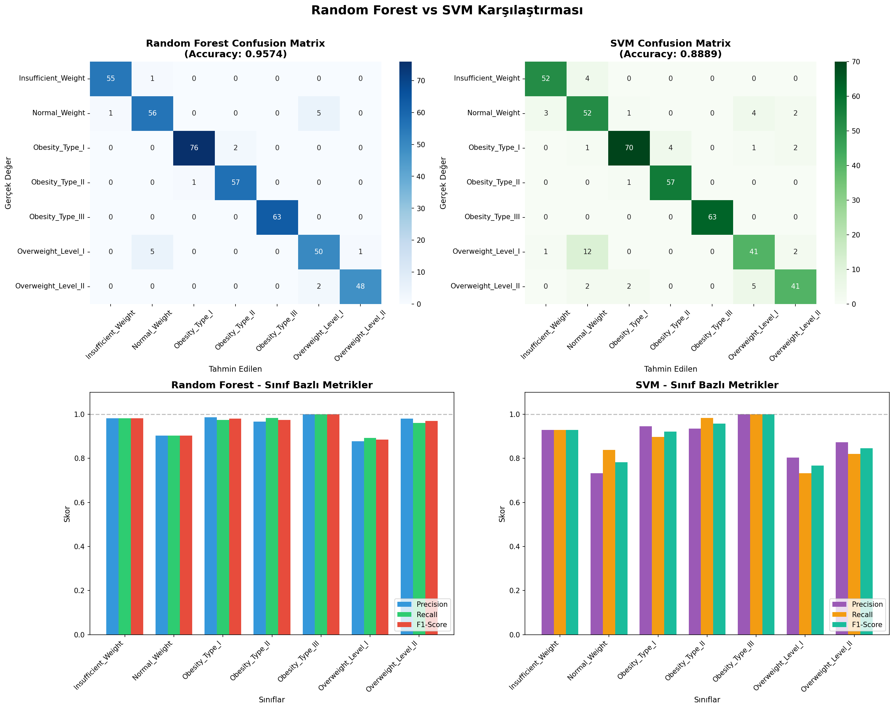
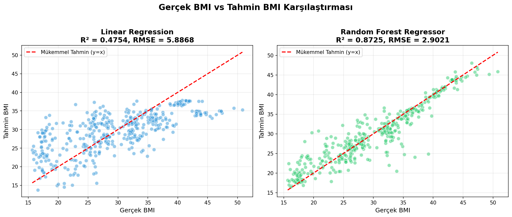
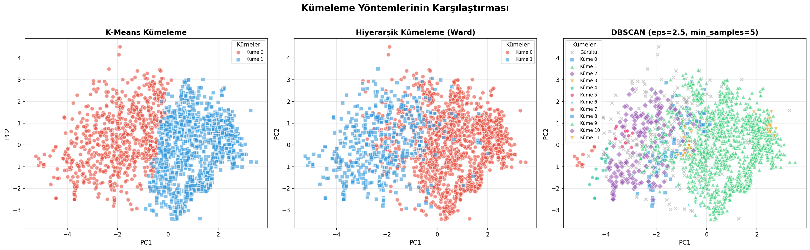

# ObesityAnalized - Obezite Veri Analizi Projesi

Bu proje, obezite veri seti üzerinde sınıflandırma, regresyon ve kümeleme analizleri gerçekleştirir.

## 🚀 Kurulum

### 1. Repoyu Klonla

```bash
git clone https://github.com/caferkarabulut/ObesityAnalized.git
cd ObesityAnalized
```

### 2. Sanal Ortamı Aktif Et

```bash
# Windows
.\venv\Scripts\activate

# Linux/Mac
source venv/bin/activate
```

### 3. Bağımlılıkları Yükle

```bash
pip install -r requirements.txt
```

## 📊 Kullanım

```bash
python main.py
```

## 📁 Proje Yapısı

```
ObesityAnalized/
├── main.py              # Ana çalıştırma dosyası
├── classification.py    # Random Forest & SVM sınıflandırma
├── regression.py        # BMI regresyon analizi
├── clustering.py        # K-Means, Hierarchical & DBSCAN kümeleme
├── ObesityDataSet.csv   # Veri seti
├── requirements.txt     # Bağımlılıklar
├── .gitignore           # Git ignore dosyası
└── venv/                # Sanal ortam
```

## 📈 Analizler

### Sınıflandırma (Classification)
- **Random Forest** ile obezite seviyesi tahmini
- **SVM (Support Vector Machine)** ile obezite seviyesi tahmini
- İki yöntemin karşılaştırmalı analizi

### Regresyon (Regression)
- **Linear Regression** ile BMI tahmini
- **Random Forest Regressor** ile BMI tahmini

### Kümeleme (Clustering)
- **K-Means** kümeleme analizi
- **Hierarchical Clustering** (Ward linkage)
- **DBSCAN** yoğunluk tabanlı kümeleme
- PCA ile 2D görselleştirme

## 📋 Çıktılar

| Dosya | Açıklama |
|-------|----------|
| `confusion_matrix_ve_metrikler.png` | Random Forest vs SVM karşılaştırması |
| `bmi_regression_sonuclari.png` | Regresyon sonuçları |
| `kmeans_elbow_silhouette.png` | K-Means optimizasyonu (Elbow & Silhouette) |
| `kmeans_pca_visualization.png` | K-Means küme görselleştirmesi |
| `clustering_comparison.png` | K-Means vs Hierarchical vs DBSCAN karşılaştırması |

## 📊 Sonuç Görselleri

### Sınıflandırma - Random Forest vs SVM


### Regresyon - BMI Tahmini


### Kümeleme - Yöntem Karşılaştırması


## 📝 Lisans

MIT License
